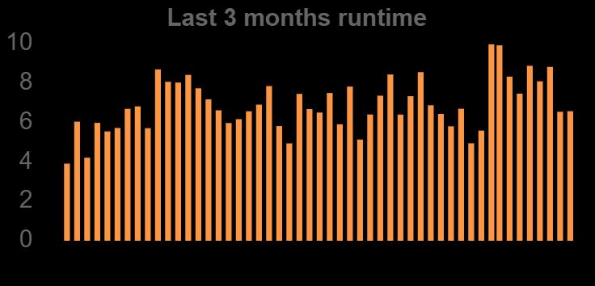

# MMM-Beestat
MagicMirror module to get Ecobee Runtime via a Beestat API
# MMM-Beestat
MagicMirror module to get Ecobee usage via Beestat
For more information visit: https://beestat.io

## API
Uses the open api that Beestat provides
https://api.beestat.io/doc
You will have to request the api key from beestat

## Preview


## Installing the module
Go to your MagicMirror modules directory by entering `cd MagicMirror/modules`

run `git clone https://github.com/vincep5/MMM-Beestat`

run `cd MMM-Beestat` to get into the newly created folder

run `npm install` to install the chart.js dependencies

## Config
Add `MMM-Beestat` module to the `modules` array in the `config/config.js` file:
````javascript
modules: [
  {
    module: "MMM-Beestat",
    position: "top_right",
    header: "Ecobee Runtime",
    config: {
        api_key: "", //request it from beestat
        ecobee_thermostat_id: 0, //via &resource=ecobee_thermostat&method=read_id
    }
  }
]
